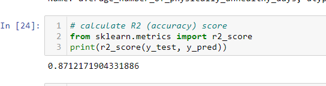
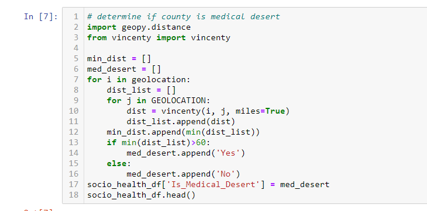
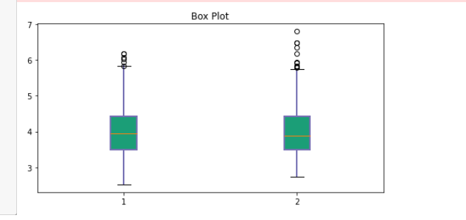
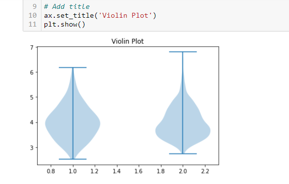

# Final_Project

## Machine Learning Model

##### The machine learning model used for this project is the LinearRegression model. This is because we seek to predict a continous data which is the Average Number of Physically Unhealthy Days in a county given certain feature variables. Using a data set with about 3000 records, each representing a county, and 79 of those counties are medical deserts, the data was split into test and train data. 743 records fell into the test category and the model achieved an accuracy of 87%.   

## Explanations

* Medical Desert Determination: The definition of a medical desert is anyplace that is more than 60 miles from an acute care hospital. From the us_hospital_locations datset, I extracted the locations of all acute care hospitals in the US. Then, using the us_county_sociohealth_data, I calculated the distance of each county from all acute care hospitals and determined the least distance. If least distance is greater than 60 miles then the county is a medical desert.  

* We sought to establish whether or not being a medical desert affects the average number of physically unhealthy days in a County. Did was done by making a box plot and a violin plot with the working dataset. Based on the plot, it was found that average number of physically unhealthy days did not differ significantly between medical desert Counties and non-mediacal-desert Counties.
 
